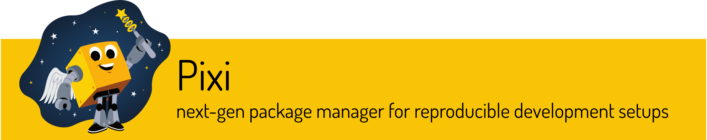

.. include:: ../common.txt

.. _gv-developer-packaging:
.. _tippy-gv-developer-packaging:

:fa:`box-archive` Packaging
===========================

.. |Pixi| image:: https://img.shields.io/endpoint?url=https://raw.githubusercontent.com/prefix-dev/pixi/main/assets/badge/v0.json
   :target: https://pixi.sh
.. |SPEC0| image:: https://img.shields.io/badge/SPEC-0-green?labelColor=%23004811&color=%235CA038
   :target: https://scientific-python.org/specs/spec-0000/

|Pixi| |SPEC0|

.. raw:: html

   

.. note::
  :class: margin, dropdown, toggle-shown

  We follow *Scientific Python Ecosystem Coordination* (`SPEC`_)
  recommendation for *Minimum Supported Dependencies* (`SPEC 0`_), and
  typically support the latest **2-3** distributions of ``python``.

Package management is orchestrated and performed by `pixi`_.

Our ``pixi`` :term:`environments <Environment>`, :term:`features <Feature>`,
and :term:`tasks <Task>` are defined within the ``pyproject.toml`` manifest file.

``pixi`` offers `fast`_, reproducible, cross-platform environment management that
enables us to `resolve`_ and provision robust, consistent environments
blended with packages from both ``conda`` and ``PyPI`` ecosystems.

We offer several similar **collections** of ``pixi`` environments for each
supported version of ``python``. Each environment within a collection belongs
to the same `solve-group`_ i.e., environments within the **same** solve-group
have their **dependencies resolved at the same time**, which means that all
those environments share the exact same dependencies but may also include
additional dependencies compatible within the solve-group.

.. tip::
  :class: dropdown, toggle-shown

  We've adopted the following format convention to help clarify each type of
  ``pixi`` component:

  - :guilabel:`environment-name`
  - ``{feature-name}``
  - ``task-name``
  - :guilabel:`&s&o&l&v&e&-&g&r&o&u&p&-&n&a&m&e`

.. _gv-developer-packaging-pixi-solve-groups:
.. _tippy-gv-developer-packaging-pixi-solve-groups:

:fa:`circle-nodes` Pixi Solve-Groups
------------------------------------

Our ``pixi`` **environments** are organized into collections by `solve-group`_.
See the ``[tool.pixi.environments]`` table defined in the ``pyproject.toml``
manifest file.

The **primary** solve-group is called :guilabel:`&d&e&f&a&u&l&t` and will always
contain the **latest** supported version of ``python``. This is denoted by the
``{py}`` feature which represents the **latest** version of ``python`` as recommended
by `SPEC 0`_.

.. table:: Pixi :guilabel:`&d&e&f&a&u&l&t` Solve-Group
   :widths: 1 2 5
   :align: center

   +----------------------+-----------------------------+--------------------------------------------------+
   | Environment          | Features                    | Description                                      |
   +======================+=============================+==================================================+
   | :guilabel:`default`  | ``{default}``, ``{py}``     | This environment contains the **core**           |
   |                      |                             | dependencies of ``geovista`` along with the      |
   |                      |                             | **latest** supported version of ``python``. See  |
   |                      |                             | the ``[tool.pixi.dependencies]`` table in the    |
   |                      |                             | ``pyproject.toml`` manifest file.                |
   +----------------------+-----------------------------+--------------------------------------------------+
   | :guilabel:`devs`     | ``{default}``, ``{devs}``,  | As per the :guilabel:`default` environment plus  |
   |                      | ``{py}``                    | additional **development** dependencies.         |
   +----------------------+-----------------------------+--------------------------------------------------+
   | :guilabel:`docs`     | ``{default}``, ``{devs}``,  | As per the :guilabel:`devs` environment plus     |
   |                      | ``{docs}``, ``{py}``        | additional **documentation** dependencies.       |
   +----------------------+-----------------------------+--------------------------------------------------+
   | :guilabel:`geovista` | ``{default}``, ``{devs}``,  | This environment is the **union** of all         |
   |                      | ``{docs}``, ``{geovista}``, | environments in the :guilabel:`&d&e&f&a&u&l&t`   |
   |                      | ``{py}``, ``{test}``        | solve-group.                                     |
   +----------------------+-----------------------------+--------------------------------------------------+
   | :guilabel:`test`     | ``{default}``, ``{devs}``,  | As per the :guilabel:`devs` environment plus     |
   |                      | ``{py}``, ``{test}``        | additional **test** dependencies.                |
   +----------------------+-----------------------------+--------------------------------------------------+

Several **secondary** solve-groups are available, each of which are named
after the version of ``python`` that they support e.g., :guilabel:`&p&y&3&1&3`.

The number of ``python`` versioned solve-groups on offer at any given
time is dictated by `SPEC 0`_.

The generic :guilabel:`&p&y&3&x&x` solve-group is used here as a convenience to
represent each of the ``python`` versioned solve-groups available, all of which
are **identical** in structure and content apart from the specific version of
``python`` that they support.

Also note that each :guilabel:`&p&y&3&x&x` solve-group will always contain the
similarly named ``{py3xx}`` feature e.g., the :guilabel:`&p&y&3&1&3` solve-group
will contain the ``{py313}`` feature which in turn defines the ``python=3.13``
dependency to be included in all ``py313`` environments.

.. table:: Pixi :guilabel:`&p&y&3&x&x` Solve-Groups
   :widths: 2 2 6
   :align: center

   +----------------------------+-----------------------------+-----------------------------------------------+
   | Environment                | Feature                     | Description                                   |
   +============================+=============================+===============================================+
   | :guilabel:`devs-py3xx`     | ``{default}``, ``{devs}``,  | As per the :guilabel:`py3xx` environment      |
   |                            | ``{py3xx}``                 | plus additional **development** dependencies. |
   +----------------------------+-----------------------------+-----------------------------------------------+
   | :guilabel:`docs-py3xx`     | ``{default}``, ``{devs}``,  | As per the :guilabel:`devs-py3xx` environment |
   |                            | ``{docs}`` , ``{py3xx}``    | plus additional **documentation**             |
   |                            |                             | dependencies.                                 |
   +----------------------------+-----------------------------+-----------------------------------------------+
   | :guilabel:`geovista-py3xx` | ``{default}``, ``{devs}``,  | This environment is the **union** of all      |
   |                            | ``{docs}``, ``{geovista}``, | environments in the same                      |
   |                            | ``{py3xx}``, ``{test}``     | :guilabel:`&p&y&3&x&x` solve-group.           |
   +----------------------------+-----------------------------+-----------------------------------------------+
   | :guilabel:`py3xx`          | ``{default}``, ``{py3xx}``  | This environment contains the **core**        |
   |                            |                             | dependencies of ``geovista`` along with       |
   |                            |                             | ``python`` version ``py3xx`` e.g., ``py313``. |
   +----------------------------+-----------------------------+-----------------------------------------------+
   | :guilabel:`test-py3xx`     | ``{default}``, ``{devs}``,  | As per the :guilabel:`devs-py3xx` environment |
   |                            | ``{py3xx}``, ``{test}``     | plus additional **test** dependencies.        |
   +----------------------------+-----------------------------+-----------------------------------------------+

.. attention::
   :class: dropdown, toggle-shown

   The generic :guilabel:`&p&y&3&x&x` solve-group does **not** exist, neither does
   the generic ``{py3xx}`` feature.

:fa:`puzzle-piece` Pixi Features
--------------------------------

A ``pixi`` :term:`environment <Environment>` is defined by combining one or
more :term:`features <Feature>`. For further details see this ``pixi`` `tutorial`_
on how to create and use features in a multi-environment scenario.

Our features are defined under the ``[tool.pixi.feature.{feature-name}.*]``
tables in the ``pyproject.toml`` manifest file.

Each named `feature table`_ e.g., ``[tool.pixi.feature.devs]``, may contain
various fields, such as ``dependencies``, ``pypi-dependencies``,
``pypi-options``, ``system-requirements``, ``activation``, ``platforms``,
``channels``, ``channel-priority``, ``target`` and ``tasks``.

.. table:: Pixi Features
   :widths: 1 2 6
   :align: center

   +----------------+-----------------------------------+-------------------------------------------------+
   | Feature        | TOML Table                        | Description                                     |
   +================+===================================+=================================================+
   | ``{default}``  | ``[tool.pixi.dependencies]``      | This feature is used to define the **core**     |
   |                |                                   | ``dependencies`` and ``tasks`` of ``geovista``. |
   |                |                                   | Note that the ``{default}`` feature is          |
   |                |                                   | `automatically included`_ in all environments   |
   |                |                                   | by ``pixi``.                                    |
   +----------------+-----------------------------------+-------------------------------------------------+
   | ``{devs}``     | ``[tool.pixi.feature.devs.*]``    | This feature is used to define the              |
   |                |                                   | **development** ``dependencies``, and           |
   |                |                                   | ``pypi-dependencies``. Note that an             |
   |                |                                   | **editable** install of ``geovista`` is         |
   |                |                                   | performed by the ``{devs}`` feature.            |
   +----------------+-----------------------------------+-------------------------------------------------+
   | ``{docs}``     | ``[tool.pixi.feature.docs.*]``    | This feature is used to define the              |
   |                |                                   | **documentation** ``dependencies``,             |
   |                |                                   | ``pypi-dependencies`` and ``tasks``.            |
   +----------------+-----------------------------------+-------------------------------------------------+
   | ``{geovista}`` | ``tool.pixi.feature.geovista.*]`` | This feature is only used to define ``tasks``.  |
   +----------------+-----------------------------------+-------------------------------------------------+
   | ``{py3xx}``    | ``[tools.pixi.feature.py3xx.*]``  | This feature is used to explicitly define the   |
   |                |                                   | version of ``python`` supported e.g.,           |
   |                |                                   | ``py313``. Note that the ``dependencies`` of    |
   |                |                                   | this feature additionally includes the ``pip``  |
   |                |                                   | package. The number of ``python`` versions      |
   |                |                                   | supported is governed by `SPEC 0`_.             |
   +----------------+-----------------------------------+-------------------------------------------------+
   | ``{test}``     | ``[tool.pixi.feature.test.*]``    | This feature is used to define the **test**     |
   |                |                                   | ``dependencies`` and ``tasks``.                 |
   +----------------+-----------------------------------+-------------------------------------------------+

:fa:`clapperboard` Pixi Tasks
-----------------------------

A ``pixi`` :term:`task <Task>` is a custom `cross-platform workflow command`_
that is defined as part of a :term:`feature <Feature>` within an
:term:`environment <Environment>`.

All our tasks are defined within the ``pyproject.toml`` manifest file.

Tasks expose a convenient and easy to use entry-point to commands that allow
streamlined and automated custom workflows.

The following tasks are defined for each of our features:

.. table:: Pixi Tasks
   :widths: 1 1 6
   :align: center

   +----------------+-----------------+---------------------------------------------------------------------+
   | Feature        | Task            | Description                                                         |
   +================+=================+=====================================================================+
   | ``{default}``  | ``download``    | Download and cache offline assets.                                  |
   |                |                 |                                                                     |
   |                |                 | This task calls the ``geovista download`` command. Provide optional |
   |                |                 | argument ``all``, ``clean``, ``doc-images``, ``dry-run``,           |
   |                |                 | ``images``, ``list``, ``natural-earth``, ``operational``,           |
   |                |                 | ``pantry``, ``rasters``, ``unit-images`` or ``verify``. Defaults to |
   |                |                 | ``all`` e.g.,                                                       |
   |                |                 |                                                                     |
   |                |                 | .. code:: console                                                   |
   |                |                 |                                                                     |
   |                |                 |     $ pixi run download operational                                 |
   |                |                 |                                                                     |
   |                |                 | See ``geovista download --help`` for further details.               |
   +----------------+-----------------+---------------------------------------------------------------------+
   | ``{docs}``     | ``clean``       | Purge all `sphinx-autoapi`_, `sphinx-gallery`_ `sphinx-tags`_,      |
   |                |                 | carousel, and other `sphinx-build`_ artifacts i.e.,                 |
   |                |                 |                                                                     |
   |                |                 | .. code:: console                                                   |
   |                |                 |                                                                     |
   |                |                 |     $ pixi run clean                                                |
   |                |                 |                                                                     |
   |                |                 | This task is an alias for the ``make clean`` command.               |
   |                +-----------------+---------------------------------------------------------------------+
   |                | ``clean-all``   | Perform both the ``clean`` and ``clean-cache`` tasks i.e.,          |
   |                |                 |                                                                     |
   |                |                 | .. code:: console                                                   |
   |                |                 |                                                                     |
   |                |                 |     $ pixi run clean-all                                            |
   |                |                 |                                                                     |
   |                |                 | This task is an alias for the ``make clean-all`` command.           |
   |                +-----------------+---------------------------------------------------------------------+
   |                | ``clean-cache`` | Purge the `myst-nb`_ Jupyter cache. See `myst-nb configuration`_    |
   |                |                 | for further details i.e.,                                           |
   |                |                 |                                                                     |
   |                |                 | .. code:: console                                                   |
   |                |                 |                                                                     |
   |                |                 |     $ pixi run clean-cache                                          |
   |                |                 |                                                                     |
   |                |                 | This task is an alias for the ``make clean-cache`` command.         |
   |                +-----------------+---------------------------------------------------------------------+
   |                | ``doctest``     | Execute `sphinx.ext.doctest`_ to test code snippets within the      |
   |                |                 | documentation i.e.,                                                 |
   |                |                 |                                                                     |
   |                |                 | .. code:: console                                                   |
   |                |                 |                                                                     |
   |                |                 |     $ pixi run doctest                                              |
   |                |                 |                                                                     |
   |                |                 | Note that the ``clean`` task is called prior to running this task.  |
   |                |                 |                                                                     |
   |                |                 | This task is an alias for the ``make doctest`` command.             |
   |                +-----------------+---------------------------------------------------------------------+
   |                | ``make``        | Build the documentation.                                            |
   |                |                 |                                                                     |
   |                |                 | Provide optional argument ``html``, ``html-docstring``,             |
   |                |                 | ``html-docstring-inline``, ``html-gallery``, ``html-inline`` or     |
   |                |                 | ``html-noplot``. Defaults to ``html-noplot`` e.g.,                  |
   |                |                 |                                                                     |
   |                |                 | .. code:: console                                                   |
   |                |                 |                                                                     |
   |                |                 |     $ pixi run make html-gallery                                    |
   |                |                 |                                                                     |
   |                |                 | Note that the ``clean`` task is called prior to running this task.  |
   |                |                 |                                                                     |
   |                |                 | This task is an alias for the ``make`` command.                     |
   |                +-----------------+---------------------------------------------------------------------+
   |                | ``serve-html``  | Build the documentation and start a local ``HTTP`` server on port   |
   |                |                 | ``11000`` to view the rendered documentation. This is necessary in  |
   |                |                 | order to support interactive scenes.                                |
   |                |                 |                                                                     |
   |                |                 | Note that the ``clean`` and ``make`` tasks are called prior to      |
   |                |                 | running this task.                                                  |
   |                |                 |                                                                     |
   |                |                 | Defaults to passing ``html-noplot`` to the ``make`` task. Override  |
   |                |                 | this behaviour by providing an alternative optional argument as     |
   |                |                 | per the ``make`` task e.g.,                                         |
   |                |                 |                                                                     |
   |                |                 | .. code:: console                                                   |
   |                |                 |                                                                     |
   |                |                 |     $ pixi run serve-html html                                      |
   |                |                 |                                                                     |
   |                |                 | This task is an alias for the ``make serve-html`` command.          |
   +----------------+-----------------+---------------------------------------------------------------------+
   | ``{geovista}`` | ``tests-docs``  | Perform documentation image tests of ``pyvista-plot`` directive     |
   |                |                 | static scenes i.e.,                                                 |
   |                |                 |                                                                     |
   |                |                 | .. code:: console                                                   |
   |                |                 |                                                                     |
   |                |                 |     $ pixi run tests-docs                                           |
   |                |                 |                                                                     |
   |                |                 | This task calls ``pytest --doc_mode`` to perform the documentation  |
   |                |                 | image tests using the `pytest-pyvista`_ plugin. Refer to the        |
   |                |                 | ``[tool.pytest.ini_options]`` table entry in the                    |
   |                |                 | ``pyproject.toml`` manifest file for default configuration options. |
   |                |                 |                                                                     |
   |                |                 | Note that the ``download doc-images`` and                           |
   |                |                 | ``make html-docstring-inline`` tasks are called prior to running    |
   |                |                 | this task.                                                          |
   |                |                 |                                                                     |
   |                |                 | This task is only available in the :guilabel:`geovista` and         |
   |                |                 | :guilabel:`geovista-py3xx` environments.                            |
   +----------------+-----------------+---------------------------------------------------------------------+
   | ``{test}``     | ``tests-clean`` | Purge all documentation and unit image test caches i.e.,            |
   |                |                 |                                                                     |
   |                |                 | .. code:: console                                                   |
   |                |                 |                                                                     |
   |                |                 |     $ pixi run tests-clean                                          |
   |                |                 |                                                                     |
   |                +-----------------+---------------------------------------------------------------------+
   |                | ``tests-unit``  | Perform unit tests.                                                 |
   |                |                 |                                                                     |
   |                |                 | This task calls the ``pytest`` command. Defaults to running all the |
   |                |                 | unit tests discoverable by ``pytest``.                              |
   |                |                 |                                                                     |
   |                |                 | Accepts a valid ``pytest`` marker as an optional argument. Refer to |
   |                |                 | the ``[tool.pytest.ini_options]`` table entry in the                |
   |                |                 | ``pyproject.toml`` manifest file for configured ``markers`` e.g.,   |
   |                |                 |                                                                     |
   |                |                 | .. code:: console                                                   |
   |                |                 |                                                                     |
   |                |                 |     $ pixi run tests-unit "not image"                               |
   |                |                 |                                                                     |
   |                |                 | Note that the ``tests-clean`` task is called prior to running this  |
   |                |                 | task.                                                               |
   +----------------+-----------------+---------------------------------------------------------------------+

.. seealso::
   :class: dropdown, toggle-shown

   The ``pixi task list`` command describes each of the tasks available within the workspace.

   Whereas ``pixi task list --summary`` enumerates the tasks available per environment.

:fab:`github` Continuous Integration
------------------------------------

.. |ci-locks| image:: https://github.com/bjlittle/geovista/actions/workflows/ci-locks.yml/badge.svg
   :target: https://github.com/bjlittle/geovista/actions/workflows/ci-locks.yml
.. |ci-wheels| image:: https://github.com/bjlittle/geovista/actions/workflows/ci-wheels.yml/badge.svg
   :target: https://github.com/bjlittle/geovista/actions/workflows/ci-wheels.yml

The following packaging workflows are available:

.. table:: Packaging Workflows
   :widths: 1 2
   :align: center

   +-------------+-------------------------------------------------------------------------------------+
   | Workflow    | Description                                                                         |
   +=============+=====================================================================================+
   | |ci-locks|  | The `ci-locks.yml`_ ``cron`` based :term:`GHA workflow <GHA>` regularly schedules   |
   |             | ``pixi`` to refresh the ``pixi.lock`` file based on the ``pyproject.toml`` manifest |
   |             | and the latest package versions available from the ``conda`` and ``PyPI``           |
   |             | ecosystems.                                                                         |
   |             |                                                                                     |
   |             | Only the **latest** ``python`` variant of the :guilabel:`geovista-py3xx`            |
   |             | environment e.g., :guilabel:`geovista-py313`, will be exported to a ``conda``       |
   |             | explicit specification file (``.txt``) and also converted to an equivalent explicit |
   |             | environment YAML file (``.yml``). These resources are available in the              |
   |             | `requirements/locks`_ directory.                                                    |
   |             |                                                                                     |
   |             | Additionally, the :guilabel:`geovista-py3xx` environment will be exported           |
   |             | to the ``conda`` environment YAML file `requirements/geovista.yml`_ containing      |
   |             | only the top-level dependencies of that environment, as defined by its              |
   |             | :ref:`features <tippy-gv-developer-packaging-pixi-solve-groups>`.                   |
   +-------------+-------------------------------------------------------------------------------------+
   | |ci-wheels| | The `ci-wheels.yml`_ :term:`GHA workflow <GHA>` builds, tests and publishes the     |
   |             | source distribution (``sdist``) and binary ``wheel`` of ``geovista``.               |
   |             |                                                                                     |
   |             | We have adopted `PyPI Trusted Publishing`_ with `OpenID Connect (OIDC)`_ for secure |
   |             | deployments of assets.                                                              |
   |             |                                                                                     |
   |             | Note that the ``sdist`` and ``wheel`` assets are automatically published to         |
   |             | `Test PyPI`_ for each ``pull-request`` merged to the ``main`` branch, and `PyPI`_   |
   |             | for each ``tag`` release.                                                           |
   +-------------+-------------------------------------------------------------------------------------+

:fab:`python` Python Package Index
----------------------------------

``PyPI`` package dependencies are configured in the ``pyproject.toml`` manifest
file under the ``[tool.setuptools.dynamic]`` and
``[tool.setuptools.dynamic.optional-dependencies]`` table entries.

Version management of our ``PyPI`` dependencies is orchestrated by :fab:`github`
`Dependabot`_. Refer to the ``package-ecosystem: "pip"`` key entry in the
`.github/dependabot.yml`_ file for further details.

The :fab:`github` `Dependabot`_ service is regularly scheduled to check the
versions of our dependencies and automatically increment them using maximum
capping pins via a ``pull-request`` in response to the latest available package
updates within the ``PyPI`` ecosystem.

.. attention::
   :class: dropdown, toggle-shown

   Updates to the ``PyPI`` maximum capping pins may require to be manually
   reflected in the ``pyproject.toml`` manifest for similar ``pixi`` managed
   ``conda`` dependencies.

   Track native :fab:`github` `Dependabot`_ support for ``pixi`` in
   `dependabot/dependabot-core issue#2227`_ 🤞

.. _Dependabot: https://docs.github.com/en/code-security/getting-started/dependabot-quickstart-guide
.. _OpenID Connect (OIDC): https://openid.net/developers/how-connect-works/
.. _PyPI Trusted Publishing: https://docs.pypi.org/trusted-publishers/
.. _SPEC: https://scientific-python.org/specs/
.. _SPEC 0: https://scientific-python.org/specs/spec-0000/
.. _.github/dependabot.yml: https://github.com/bjlittle/geovista/blob/main/.github/dependabot.yml
.. _automatically included: https://pixi.sh/latest/tutorials/multi_environment/#default
.. _ci-locks.yml: https://github.com/bjlittle/geovista/blob/main/.github/workflows/ci-locks.yml
.. _ci-wheels.yml: https://github.com/bjlittle/geovista/blob/main/.github/workflows/ci-wheels.yml
.. _cross-platform workflow command: https://pixi.sh/latest/workspace/advanced_tasks/
.. _dependabot/dependabot-core issue#2227: https://github.com/dependabot/dependabot-core/issues/2227#issuecomment-1709069470
.. _fast: https://prefix.dev/blog/sharded_repodata
.. _feature table: https://pixi.sh/latest/reference/pixi_manifest/#the-feature-table
.. _myst-nb configuration: https://myst-nb.readthedocs.io/en/latest/configuration.html
.. _requirements/geovista.yml: https://github.com/bjlittle/geovista/blob/main/requirements/geovista.yml
.. _requirements/locks: https://github.com/bjlittle/geovista/tree/main/requirements/locks
.. _resolve: https://pixi.sh/latest/workspace/environment/#solving-environments
.. _solve-group: https://pixi.sh/latest/workspace/multi_environment/#feature-environment-set-definitions
.. _tutorial: https://pixi.sh/latest/tutorials/multi_environment/
