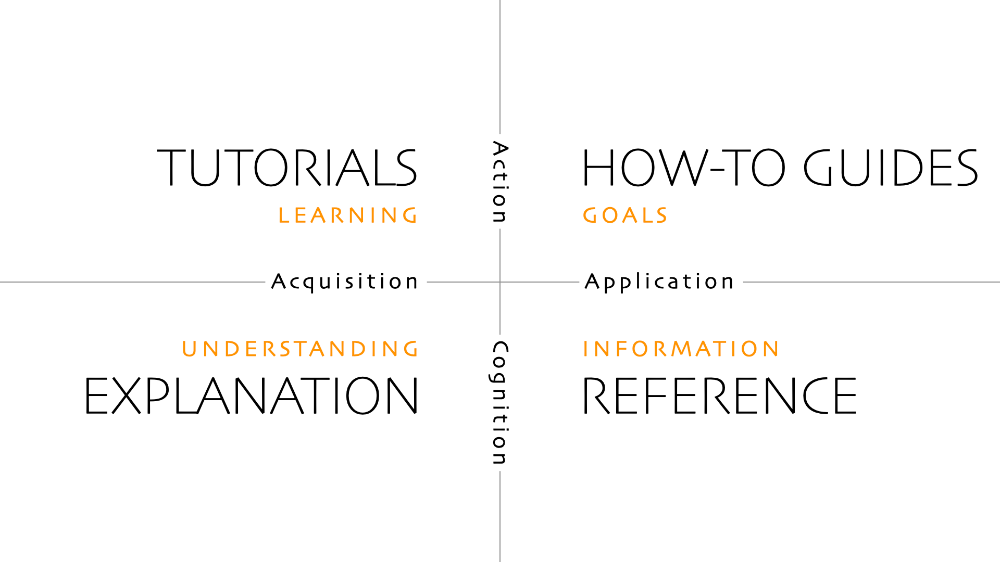

.. include:: common.txt

.. _gv-next-steps:

:fa:`seedling` Next Steps
=========================

.. note::
    :class: margin, dropdown, toggle-shown

    Content marked with 🚧 indicates it's still under construction.

After a brief :ref:`overview <gv-overview>` and
:ref:`introduction <gv-quick-start>` to ``geovista``, hopefully you'll be keen
to explore and learn more.

The next step you choose to take is a personal one. It depends on how you
best learn given what you want to achieve.

To help us, help you, get the best out of ``geovista``, we've adopted the
`Diátaxis`_ framework to authoring our documentation.

It provides best practice advice on how to *organise* documentation in
a systematic way, with a focus on *content* and *style* that addresses the
four distinct needs of documentation users (see :numref:`diátaxis-figure`).

    Diátaxis Axes of Needs

.. note::
    :class: dropdown

    Namely, acquiring *practical knowledge*, knowing *how*, through *working*:

    - **Tutorials** - A learning experience through practical lessons.
    - **How-To Guides** - Goal-focused practical guides on specific topics.

    Acquiring *theoretical knowledge*, knowing *that*, through *studying*:

    - **Explanation** - Achieve understanding through discussion and reflection.
    - **Reference** - Succinct factual information laid bare.

So if you learn by *doing*, then explore our *hands-on* themed lessons or
topic specific how-tos:

.. grid:: 1 1 2 2
    :gutter: 2

    .. grid-item-card:: Tutorials
        :class-title: custom-title
        :class-body: custom-body
        :link: gv-tutorials
        :link-type: ref
        :img-top: _static/images/icons/tutorials.svg
        :class-img-top: dark-light
        :class-card: sd-rounded-3

        Topic driven themed lessons.

    .. grid-item-card:: 🚧 How-To Guides
        :class-title: custom-title
        :class-body: custom-body
        :link: gv-howtos
        :link-type: ref
        :img-top: _static/images/icons/howtos.svg
        :class-img-top: dark-light
        :class-card: sd-rounded-3

        Treasure trove of focused guides.

If you learn by *studying*, then delve into unfolding explanations or simply
consult the facts:

.. grid:: 1 1 2 2
    :gutter: 2

    .. grid-item-card:: 🚧 Explanation
        :class-title: custom-title
        :class-body: custom-body
        :link: gv-explanation
        :link-type: ref
        :img-top: _static/images/icons/explanation.svg
        :class-img-top: dark-light
        :class-card: sd-rounded-3

        Deeper understanding awaits.

    .. grid-item-card:: Reference
        :class-title: custom-title
        :class-body: custom-body
        :link: gv-reference
        :link-type: ref
        :img-top: _static/images/icons/reference.svg
        :class-img-top: dark-light
        :class-card: sd-rounded-3

        No fuss facts.

If you're visually motivated and simply want to see some eye-candy, then why
not dive straight into our gallery. Alternatively, use our tags to navigate to
similar gallery examples organised by specific features:

.. grid:: 1 1 2 2
    :gutter: 2

    .. grid-item-card:: Examples
        :class-title: custom-title
        :class-body: custom-body
        :link: gv-examples-gallery
        :link-type: ref
        :img-top: _static/images/icons/examples.svg
        :class-img-top: dark-light
        :class-card: sd-rounded-3

        Peruse the Gallery.

    .. grid-item-card:: Tags
        :class-title: custom-title
        :class-body: custom-body
        :link: tagoverview
        :link-type: ref
        :img-top: _static/images/icons/tags.svg
        :class-img-top: dark-light
        :class-card: sd-rounded-3

        Examples themed by feature.

However, if you're a developer and want to contribute, then
we've curated some best practice, process and advice that'll help you get up
and running in a snap:

.. card:: 🚧 Contributing
    :class-title: custom-title
    :class-body: custom-body
    :link: gv-developer
    :link-type: ref
    :img-top: _static/images/icons/contributing.svg
    :class-img-top: dark-light
    :class-card: sd-rounded-3
    :width: 50%
    :margin: 4 4 auto auto

    Developer hub.
