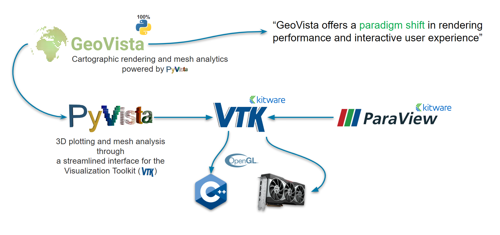
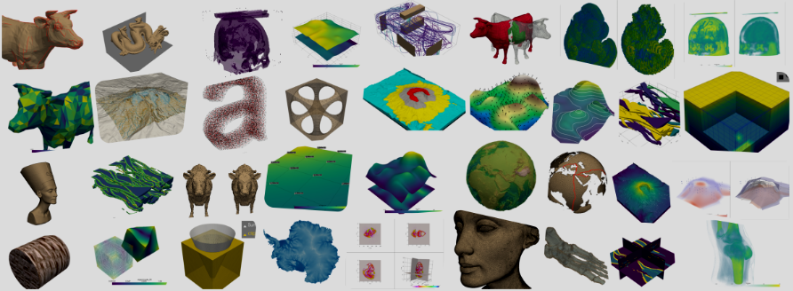

.. include:: common.txt

.. _gv-overview:
.. _tippy-gv-overview:

:fa:`panorama` Overview
=======================

Here we give a high-level overview of ``geovista``.

We briefly discuss its goals and motivation, and introduce you to the rich,
powerful ecosystem that underpins its evolving capability.

:fa:`star-of-life` Motivation
-----------------------------

``geovista`` is a pure `Python`_ package that offers performant,
publication quality 3D cartographic rendering of Earth Science data.

Its goal is to lower the bar for scientists, such that they can easily
analyze, visualize, and explore their rectilinear, curvilinear and
unstructured geospatial data interactively in 3D, whilst also supporting
traditional 2D static plots, cartographic projections and coordinate
transformations.

Our intention is for ``geovista`` to be a cartographic gateway into the
powerful world of `PyVista`_, and all that it offers. Opening the door
for scientists to rediscover their data through a responsive visualization
toolchain that leverages the power of the GPU.

Simply put,

.. rst-class:: center

    .. epigraph::

        "`GeoVista`_ is to `PyVista`_", as "`Cartopy`_ is to `Matplotlib`_"

That's our aspiration.

Akin to `Cartopy`_, we intend ``geovista`` to remain as flexible and
open-ended as possible to the Scientific Python community. This means that
``geovista`` will remain agnostic to packages that specialize in preparing
your spatial data for visualization, such as `geopandas`_, `iris`_ and
`xarray`_.

.. _gv-overview-ecosystem:
.. _tippy-gv-overview-ecosystem:

:fa:`recycle` Ecosystem
-----------------------

``geovista`` is built on the shoulders of giants, namely `PyVista`_ and the
`Visualization Toolkit`_ (VTK), thus allowing it to easily leverage the power
of the GPU.

    Ecosystem of ``geovista``

As shown above, ``geovista`` is built upon a performant, established, and
feature rich `VTK`_ toolchain, which is supported and maintained by
`Kitware`_ and the open-source community.

This toolchain is enabled through `PyVista`_, which exposes the powerful
visualization backend of `VTK`_ through an intuitive Pythonic interface.

:fab:`python` PyVista in a Nutshell
^^^^^^^^^^^^^^^^^^^^^^^^^^^^^^^^^^^

    PyVista Examples

`PyVista`_ is a powerful open-source 3D visualization library built on
`VTK`_, providing:

- A Pythonic, high-level, and streamlined API to `VTK`_
- `Mesh data structures`_
- Batteries-included access to a rich suite of mesh `filtering algorithms`_
- GPU accelerated visualization
- Scales up to large and complex geometries
- Interoperability with `ParaView`_ through `VTK`_ (see :numref:`tippy-gv-overview-ecosystem-geovista-ecosystem`)
- Static and interactive plot integration within `Jupyter`_ ecosystem

:fa:`battery-quarter` Development Status
----------------------------------------

It's still early days for ``geovista``, but we're already excited about the
potential and promise that it might offer to the Earth Science community.

Our primary focus at the moment is to provision a stable API and core set of
features ... we're working hard on that, but we're not there yet!

Thanks for your patience 🙏

.. comment

   🔗 URL resources in alphabetical order:

.. _Jupyter: https://jupyter.org/
.. _Mesh data structures: https://docs.pyvista.org/examples/index.html#mesh-creation
.. _ParaView: https://www.paraview.org/
.. _filtering algorithms: https://docs.pyvista.org/examples/index.html#filtering
