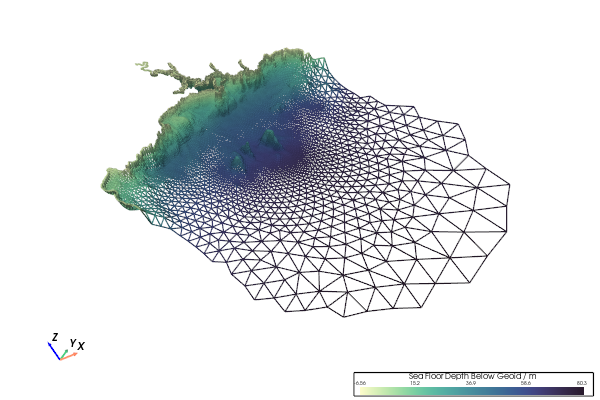
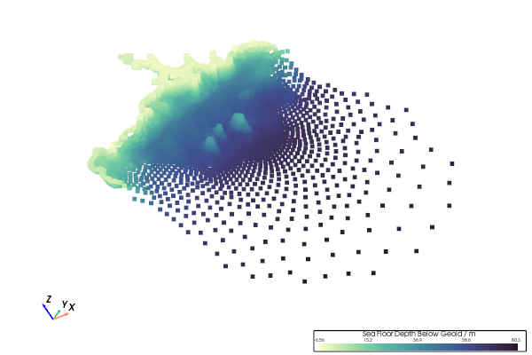

.. include:: ../common.txt

.. _gv-reference-bindings:
.. _tippy-gv-reference-bindings:

:fa:`keyboard` Key Bindings
===========================

.. tip::
    :class: margin, dropdown, toggle-shown

    For further details also see the `pyvista keyboard bindings`_.

Primary keyboard and mouse bindings that control the rendered scene.

.. tab-set::

    .. tab-item:: :fab:`linux` / :fab:`windows`

        .. table:: Bindings (Linux/Windows)
            :widths: auto

            +----------------------------------------+------------------------------------------------+--------------+
            | :fa:`keyboard` + :fa:`computer-mouse`  | Action                                         | Example      |
            +========================================+================================================+==============+
            | :guilabel:`f` (`Qt`_)                  | Focus and zoom to a point.                     | |fvcom-f|    |
            +----------------------------------------+------------------------------------------------+--------------+
            | :guilabel:`q`                          | Quit the rendering window.                     |              |
            +----------------------------------------+------------------------------------------------+--------------+
            | :guilabel:`r`                          | Reset the camera.                              |              |
            +----------------------------------------+------------------------------------------------+--------------+
            | :guilabel:`s`                          | Render scene using ``surface`` style.          | |fvcom-s|    |
            +----------------------------------------+------------------------------------------------+--------------+
            | :guilabel:`v` (`Qt`_)                  | Snap to `isometric camera`_ view.              |              |
            +----------------------------------------+------------------------------------------------+--------------+
            | :guilabel:`v` (`Trame`_)               | Render scene using ``points`` style.           | |fvcom-p|    |
            +----------------------------------------+------------------------------------------------+--------------+
            | :guilabel:`w`                          | Render scene using ``wireframe`` style.        | |fvcom-w|    |
            +----------------------------------------+------------------------------------------------+--------------+
            | :guilabel:`L-Click`                    | Rotate the rendered scene in 3D.               | |fvcom-3d|   |
            +----------------------------------------+------------------------------------------------+--------------+
            | :guilabel:`Ctrl + L-Click`             | Rotate the rendered scene in 2D (view plane).  | |fvcom-2d|   |
            +----------------------------------------+------------------------------------------------+--------------+
            | :guilabel:`Shift + L-Click` or         | Pan the rendered scene.                        | |fvcom-pan|  |
            | :guilabel:`M-Click`                    |                                                |              |
            +----------------------------------------+------------------------------------------------+--------------+
            | :guilabel:`Mouse-Wheel` or             | Continuously zoom the rendering scene.         | |fvcom-zoom| |
            | :guilabel:`R-Click`:sup:`†`            |                                                |              |
            +----------------------------------------+------------------------------------------------+--------------+

        :guilabel:`†` - **not** `Trame`_

    .. tab-item:: :fab:`apple`

        .. table:: Bindings (Mac)
            :widths: auto

            +----------------------------------------+------------------------------------------------+--------------+
            | :fa:`keyboard` + :fa:`computer-mouse`  | Action                                         | Example      |
            +========================================+================================================+==============+
            | :guilabel:`f` (`Qt`_)                  | Focus and zoom to a point.                     | |fvcom-f|    |
            +----------------------------------------+------------------------------------------------+--------------+
            | :guilabel:`q`                          | Quit the rendering window.                     |              |
            +----------------------------------------+------------------------------------------------+--------------+
            | :guilabel:`r`                          | Reset the camera.                              |              |
            +----------------------------------------+------------------------------------------------+--------------+
            | :guilabel:`s`                          | Render scene using ``surface`` style.          | |fvcom-s|    |
            +----------------------------------------+------------------------------------------------+--------------+
            | :guilabel:`v` (`Qt`_)                  | Snap to `isometric camera`_ view.              |              |
            +----------------------------------------+------------------------------------------------+--------------+
            | :guilabel:`v` (`Trame`_)               | Render scene using ``points`` style.           | |fvcom-p|    |
            +----------------------------------------+------------------------------------------------+--------------+
            | :guilabel:`w`                          | Render scene using ``wireframe`` style.        | |fvcom-w|    |
            +----------------------------------------+------------------------------------------------+--------------+
            | :guilabel:`Click`                      | Rotate the rendered scene in 3D.               | |fvcom-3d|   |
            +----------------------------------------+------------------------------------------------+--------------+
            | :guilabel:`⌘ + Click` or               | Rotate the rendered scene in 2D (view plane).  | |fvcom-2d|   |
            | :guilabel:`Ctrl + Click`               |                                                |              |
            +----------------------------------------+------------------------------------------------+--------------+
            | :guilabel:`Shift + Click`              | Pan the rendered scene.                        | |fvcom-pan|  |
            +----------------------------------------+------------------------------------------------+--------------+
            | :guilabel:`Mouse-Wheel` or             | Continuously zoom the rendering scene.         | |fvcom-zoom| |
            | :guilabel:`R-Click`                    |                                                |              |
            +----------------------------------------+------------------------------------------------+--------------+

.. comment

    ⚠️ The FVCOM example (geovista.examples.warp.from_unstructured__fvcom) GIFs
       used the following camera position:

       cpos = [(0.652936947323311, -0.06686933227332881, 0.7722722989946459),
               (0.638759454274243, -0.04909585033098298, 0.7656316102303734),
               (0.29679655733036037, 0.5328351105797621, 0.7924635944258254)]

.. |fvcom-s| image::  ../_static/images/fvcom-surface.png
    :scale: 30%
    :align: middle
    :width: 600
    :height: 400
    :alt: FVCOM surface

.. |fvcom-f| image:: https://raw.githubusercontent.com/bjlittle/geovista-media/2026.02.4/media/docs/fvcom-f.gif
    :scale: 30%
    :align: middle
    :width: 600
    :height: 400
    :alt: Camera Follow

.. |fvcom-3d| image:: https://raw.githubusercontent.com/bjlittle/geovista-media/2026.02.4/media/docs/fvcom-rotate-3d.gif
    :scale: 30%
    :align: middle
    :width: 600
    :height: 400
    :alt: Rotate 3D

.. |fvcom-2d| image:: https://raw.githubusercontent.com/bjlittle/geovista-media/2026.02.4/media/docs/fvcom-rotate-2d.gif
    :scale: 30%
    :align: middle
    :width: 600
    :height: 400
    :alt: Rotate 2D

.. |fvcom-pan| image:: https://raw.githubusercontent.com/bjlittle/geovista-media/2026.02.4/media/docs/fvcom-pan.gif
    :scale: 30%
    :align: middle
    :width: 600
    :height: 400
    :alt: Camera Pan

.. |fvcom-zoom| image:: https://raw.githubusercontent.com/bjlittle/geovista-media/2026.02.4/media/docs/fvcom-zoom.gif
    :scale: 30%
    :align: middle
    :width: 600
    :height: 400
    :alt: Camera Zoom

.. comment

    🔗 URL resources in alphabetical order:

.. _isometric camera: https://docs.pyvista.org/api/plotting/_autosummary/pyvista.plotter.view_isometric
.. _pyvista keyboard bindings: https://docs.pyvista.org/api/plotting/plotting.html#plotting
